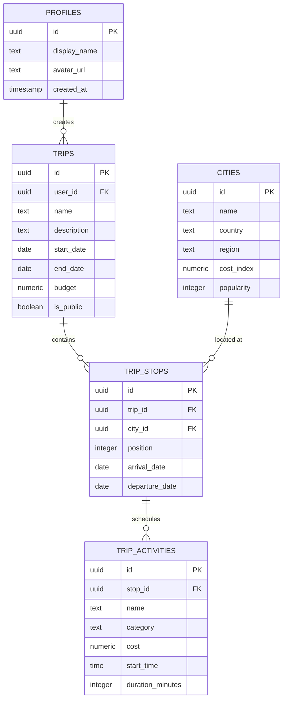

<div align="center">

#  GlobeTrotter

### **Next-Gen Multi-City Travel Planner & Itinerary Engine**

A modern, full-stack travel planning platform with day-wise itinerary builder, dynamic budget tracking, global destination discovery, and responsive mobile-first design.

[](https://globetrotter-black.vercel.app/)
[](https://react.dev/)
[](https://www.typescriptlang.org/)
[](https://supabase.com/)
[](https://tailwindcss.com/)

[**Explore Live Application →**](https://globetrotter-black.vercel.app/) · [**Report Bug**](https://github.com/ujas1010/GlobeTrotter/issues) · [**Request Feature**](https://github.com/ujas1010/GlobeTrotter/issues)

</div>

---

## 🌟 Key Features

| Feature | Description |
| :--- | :--- |
| 🗺️ **Multi-City Route Planner** | Plan multi-destination expeditions with automated timeline generation, stop sequencing, and date validation. |
| 💰 **Live Budget Engine** | Real-time budget monitoring, average daily spend calculation, and activity cost breakdown. |
| 🔍 **Worldwide Destination Explorer** | Search through millions of global cities, regions, and districts with GeoNames geocoding and live catalogue addition. |
| ⏱️ **Day-Wise Activity Timeline** | Schedule timed activities, categorise expenses (Sightseeing, Dining, Transport), and track duration per stop. |
| 🔒 **Enterprise Authentication** | Google OAuth integration and secure email/password authentication with session persistence via Supabase. |
| 📱 **Mobile-First Responsive Design** | Optimized viewport ergonomics, adaptive typography, and native-feeling mobile bottom bar navigation with safe-area insets. |
| 👤 **User Profile & Customization** | Manage avatar uploads, display names, and private travel preferences. |

---

## 🛠️ Tech Stack

```
Frontend:       React 19, TanStack Router, TanStack Query, Tailwind CSS v4, Lucide Icons
Backend / BaaS: Supabase (PostgreSQL, Auth, RLS, Storage)
Framework:      TanStack Start & Vite 8 with Nitro SSR Engine
Deployment:     Vercel Edge Platform
```

---

## 🗄️ Database Architecture



---

## 🚀 Getting Started

### Prerequisites
- **Node.js**: `v20.x` or higher
- **npm** / **pnpm** / **bun**

### 1. Clone the repository
```bash
git clone https://github.com/ujas1010/GlobeTrotter.git
cd GlobeTrotter
```

### 2. Install dependencies
```bash
npm install
```

### 3. Setup Environment Variables
Create a `.env` file in the root directory:
```env
VITE_SUPABASE_URL=https://your-project-id.supabase.co
VITE_SUPABASE_PUBLISHABLE_KEY=your-supabase-publishable-key
VITE_GOOGLE_CLIENT_ID=your-google-client-id.apps.googleusercontent.com
```

### 4. Run Development Server
```bash
npm run dev
```
Open **[http://localhost:5173](http://localhost:5173)** in your browser.

---

## 📦 Production Build

```bash
npm run build
npm run preview
```

---

## 👤 Author

**Ujas Darji**
- GitHub: [@ujas1010](https://github.com/ujas1010)
- Live Project: [GlobeTrotter on Vercel](https://globetrotter-black.vercel.app/)

---

## 📄 License

This project is licensed under the MIT License — see the [LICENSE](LICENSE) file for details.
